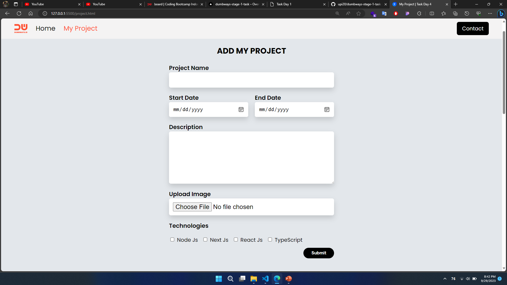

## Task Day 1 2023-09-25

Setelah mempelajari terkait membuat halaman blog yang dapat interaktif menggunakan Javascript, maka silakan implementasi materi yang telah dipelajari dengan mengambil data dari form Add My Project, kemudian tampilkan pada bagian list My Project, beserta tambahkan page detail project seperti pada Mockup

  

## Submit

  
  

npx sequelize-cli db:migrate:undo:all && npx sequelize-cli db:migrate && npx sequelize-cli db:seed:all
